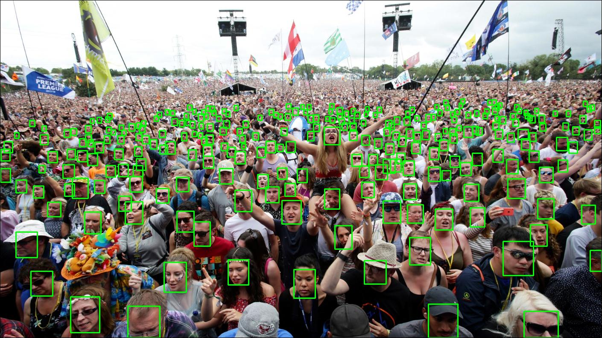
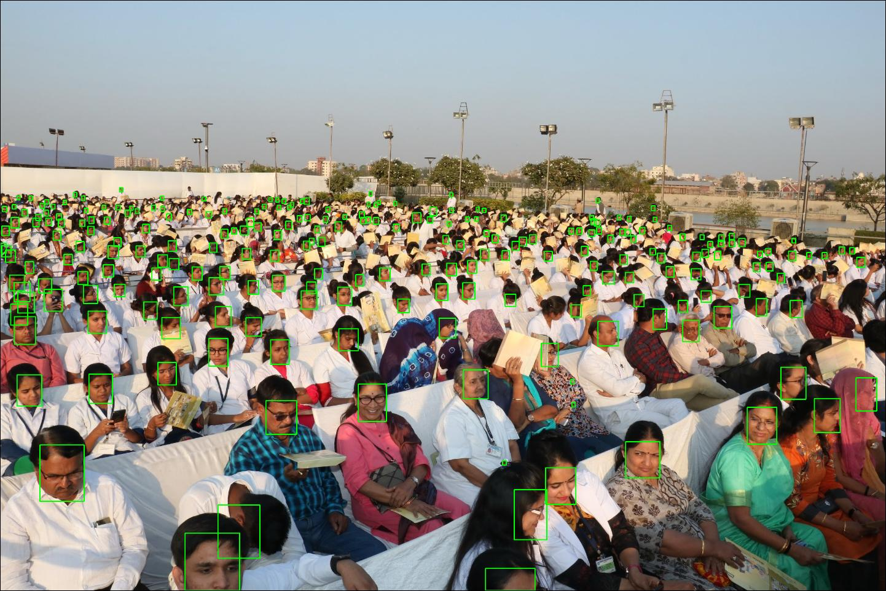
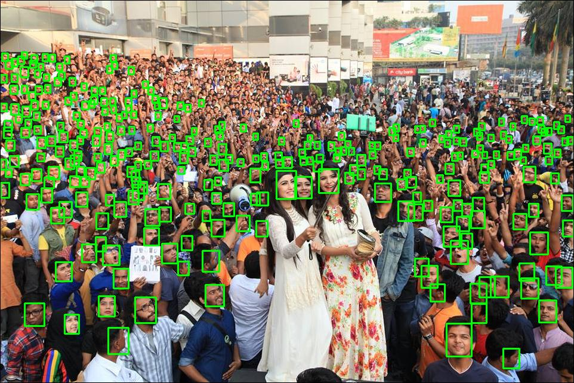
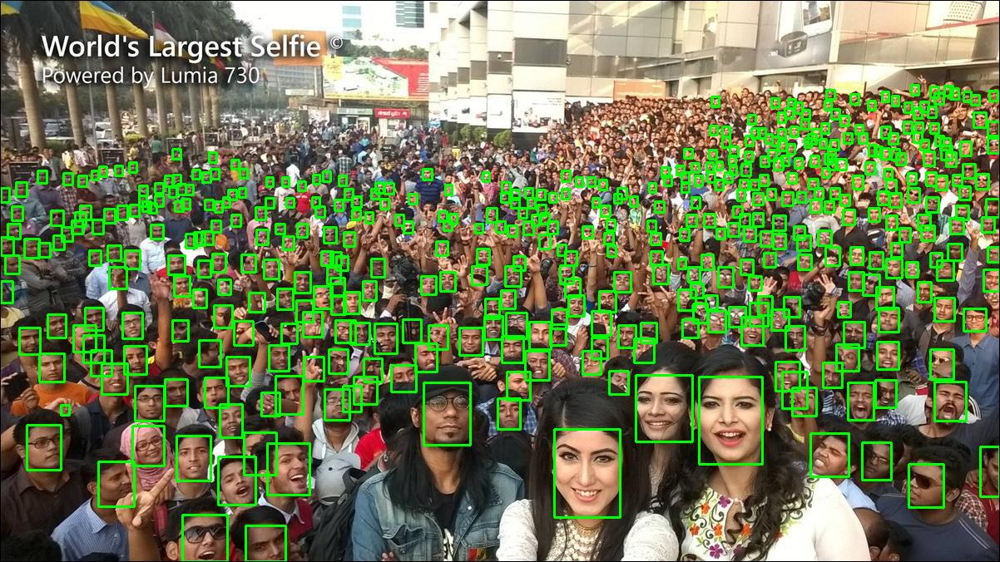
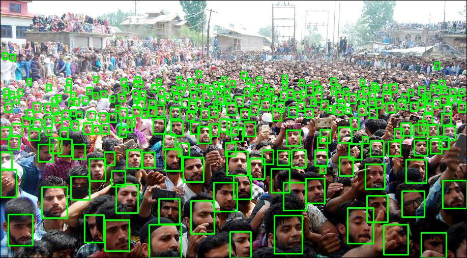

## Face Detection
This subdir includes face detection related codes. Some descriptions has 
been presented in repo README.md. 

### Recent Update
* `2019.08.01` model v1 (in the paper) and v2 are added.
* `2019.08.22` latency evaluation on TX2 is added.
* `2019.08.25` RetinaFace-MobileNet-0.25 related content is added (both accuracy and latency).

### Brief Introduction to Model Version
* v1 - refer to the paper for details
* v2 - the detection scale is 10-320 (vs 10-560 in v1), the number of layers is 20, 
the backbone is modified for faster inference. Refer to `./symbol_farm/symbol_structures.xlsx` for details.

### Accuracy
All accuracy evaluations are conducted under the **SIO** schema (please refer to the paper for details).

* Results on val set of WIDER FACE:

Model Version|Easy Set|Medium Set|Hard Set
------|--------|----------|--------
RetinaFace-mnet|0.896|0.871|0.681
v1|0.910|0.881|0.780
v2|0.837|0.835|0.729

> * due to giving up detecting large faces, the accuracy of v2 decreases obviously compared to v1.
In fact, v2 is enough for practical use.
> * **RetinaFace-mnet** is short for RetinaFace-MobileNet-0.25. (The excellent work from [insightface](https://github.com/deepinsight/insightface))

* Results on FDDB:

Model Version|Disc ROC curves score
------|--------
RetinaFace-mnet|0.960
v1|0.973
v2|0.972

### Inference Latency
* Platform info: NVIDIA Jetson NANO, CUDA 10.0, CUDNN 7.5.0, TensorRT 5.1.6

Model Version|160×140|320×240|640×480|1280×720
-------------|-------|-------|-------|--------
v1|12.94ms(77.26FPS)|33.66ms(29.70FPS)|113.88ms(8.78FPS)|326.91ms(3.06FPS)
v2|10.48ms(95.39FPS)|23.28ms(42.96FPS)|77.56ms(12.89FPS)|222.30ms(4.50FPS)

> CAUTION: The latency may vary even in the same setting.

* Platform info: NVIDIA Jetson TX2, CUDA 10.0, CUDNN 7.5.0, TensorRT 5.1.6 (power mode: MAXN)

Model Version|160×140|320×240|640×480|1280×720|1920×1080
-------------|-------|-------|-------|--------|---------
v1|6.12ms(163.47FPS)|13.50ms(74.06FPS)|46.65ms(21.44FPS)|131.38ms(7.61FPS)|291.24ms(3.43FPS)
v2|4.40ms(227.39FPS)|9.15ms(109.31FPS)|31.46ms(31.79FPS)|89.22ms(11.21FPS)|198.79ms(5.03FPS)

> CAUTION: The latency may vary even in the same setting.

* Platform info: NVIDIA RTX 2080TI, CUDA 10.0, CUDNN 7.4.2, TensorRT 5.1.5.0

Model Version|320×240|640×480|1280×720|1920×1080|3840×2160|7680×4320
-------------|-------|-------|--------|---------|---------|---------
v1|1.33ms(750.16FPS)|2.85ms(350.55FPS)|6.97ms(143.40FPS)|15.10ms(66.22FPS)|59.91ms(16.69FPS)|233.19ms(4.29FPS)
v2|1.06ms(946.04FPS)|2.12ms(472.04FPS)|5.02ms(199.10FPS)|10.80ms(92.63FPS)|42.41ms(23.58FPS)|167.25ms(5.98FPS)

* Platform info: NVIDIA GTX 1060(laptop), CUDA 10.0, CUDNN 7.4.2, TensorRT 5.1.5.0

Model Version|320×240|640×480|1280×720|1920×1080|3840×2160
-------------|-------|-------|--------|---------|---------
v1|2.54ms(393.78FPS)|7.28ms(137.28FPS)|20.13ms(49.67FPS)|44.76ms(22.34FPS)|176.54ms(5.66FPS)
v2|1.84ms(544.93FPS)|5.06ms(197.53FPS)|13.97ms(71.60FPS)|30.47ms(32.82FPS)|121.53ms(8.23FPS)

* Platform info: ARM A53@1.4GHz, Ubuntu 18.04-64bit, MNN&Tegine (coming soon)

> MNN

Model Version|160×140|320×240|640×480|1280×720|1920×1080
-------------|-------|-------|-------|--------|---------
v1|-|-|-|-|-
v2|-|-|-|-|-

> Tegine

Model Version|160×140|320×240|640×480|1280×720|1920×1080
-------------|-------|-------|-------|--------|---------
v1|-|-|-|-|-
v2|-|-|-|-|-

* Platform info: Intel Movidius NCS1 and NCS2  (in the future)

> NCS1

Model Version|160×140|320×240|640×480|1280×720|1920×1080
-------------|-------|-------|-------|--------|---------
v1|-|-|-|-|-
v2|-|-|-|-|-

> NCS2

Model Version|160×140|320×240|640×480|1280×720|1920×1080
-------------|-------|-------|-------|--------|---------
v1|-|-|-|-|-
v2|-|-|-|-|-

### Inference Latency vs RetinaFace-MobileNet-0.25
The UpSampling operator is not supported by mx2onnx currently, so it is not so easy to convert to onnx format for TensorRT evaluation.
We use MXNet with CUDNN instead (this also can reflect the latency trend).

* Latency on NVIDIA RTX 2080TI (MXNet+CUDA 10.0+CUDNN7.4.2):

Resolution->|640×480|1280×720|1920×1080|3840×2160|7680×4320
------------|-------|--------|---------|---------|---------
RetinaFace-mnet|5.40ms(185.26FPS)|6.31ms(158.60FPS)|10.26ms(97.47FPS)|29.29ms(34.14FPS)|118.42ms(8.44FPS)
v1|7.24ms(138.16FPS)|14.58ms(68.57FPS)|28.36ms(35.26FPS)|100.18ms(9.98FPS)|380.62ms(2.63FPS)
v2|5.04ms(198.59FPS)|9.79ms(102.14FPS)|18.17ms(55.04FPS)|65.86ms(15.18FPS)|245.16ms(4.08FPS)

* Latency on NVIDIA GTX 1060(laptop) (MXNet+CUDA 10.0+CUDNN7.4.2):

Resolution->|640×480|1280×720|1920×1080|3840×2160
------------|-------|--------|---------|---------
RetinaFace-mnet|4.90ms(204.17FPS)|10.85ms(92.19FPS)|22.44ms(44.57FPS)|79.48.29ms(12.58FPS)
v1|16.47ms(60.73FPS)|45.43ms(22.01FPS)|100.23ms(9.98FPS)|399.50ms(2.50FPS)
v2|10.99ms(90.97FPS)|29.45ms(33.96FPS)|63.64ms(15.71FPS)|253.89ms(3.94FPS)

**RetinaFace-mnet** uses MobileNet v1 as pre-trained backbone, showing both excellent accuracy and low latency. In the future, we will
also explore much lighter backbone.

### User Instructions
**If you just want to experience the trained model, head to the script `./accuracy_evaluation/predict.py` and 
you can test your own images easily.**

First, we introduce the functionality of each sub directory.
* [accuracy_evaluation](accuracy_evaluation). This folder contains the evaluation code for WIDERFACE and FDDB.
The code only produces formatted results files. Please use the official code for metric calculation. 
[WIDERFACE website](http://shuoyang1213.me/WIDERFACE/), [FDDB website](http://vis-www.cs.umass.edu/fddb/).
* [symbol_farm](symbol_farm). This folder contains net definitions for all model versions.
* [metric_farm](metric_farm). This folder contains the metrics for training monitoring.
* [inference_speed_evaluation](inference_speed_evaluation). This folder contains the inference latency evaluation code.
Currently, MXNet with CUDNN and TensorRT with CUDNN are supported.
* [deploy_tensorrt](deploy_tensorrt). This folder contains the code of deployment with TensorRT. For more details, 
please refer to [README.md](deploy_tensorrt/README.md).
* [data_provider_farm](data_provider_farm). This folder contains the code of raw data processing/formatting/packing&unpacking.
* [data_iterator_farm](data_iterator_farm). This folder contains the code of multi-threaded data prefetching. 
**This is the most important part, since it describe the essence of LFFD!!!**
* [config_farm](config_farm). This folder contains the configurations of all model versions. The training is started by running the
corresponding config python script.

Second, we present a common procedure for running the code for training (taking v1 as an example).

1. prepare symbol net `symbol_farm/symbol_10_560_25L_8scales_v1.py`
2. (optional) check the latency by using `inference_speed_evaluation/inference_speed_eval.py`
3. prepare the training data by using the code in `data_provider_farm`. We provide a packed 
training data of WIDERFACE trainset. Please download from **Data Download**.
4. adjust the code around the line 241 in `data_iterator_farm/multithread_dataiter_for_cross_entropy_vx`.
This segment of code may vary task to task.
5. set the variables in configuration py script in `config_farm` and run.

### Advanced Tips
* In practical, we always know the rough scales of the target objects. For example, in a face 1:1 identification device,
the face is near the device and may ony vary from 300 pixels to 900 pixels. If we use v1 for detection, we can 
rescale the original image with the factor 10/300, namely transferring detection of [300, 900] to [10, 30]. Additionally, 
the deeper branches (4, 5, 6, 7, 8) are no longer useful, they can be cut off. The two means (rescale and cut off) will 
further decrease the latency. That is to say, for a specific task, the model can be modified to better adapt for the scenario.

* Change to low bit data type, like float16 and int8. This will make the model run with smaller memory footprints. The latency
may not definitely decrease, and it depends on the hardware platform. TensorRT supports float16 and int8.

* Network pruning and compression techniques are also available for smaller mode size and lower latency. 
(we may add this in the future)

### Data Download
We have packed the training data of WIDERFACE train set. In the data, the faces less than 8 pixels are ignored, and some pure negative 
images cropped from the training images are also added. We provide three ways to download the packed data:
* [Baidu Yunpan](https://pan.baidu.com/s/1a8Wk4GNkfPYbKAFSrZzFIQ) (pwd:e7bv)
* [MS OneDrive](https://1drv.ms/u/s!Av9h0YMgxdaSgwiP4nKDasu4m73J?e=v5UfWQ)
* [Google Drive](https://drive.google.com/open?id=1O3nJ6mQKD_sdFpfXmYoK7xnTUg3To7kO)

After you download the data, you can put it anywhere. Remember to set `param_trainset_pickle_file_path` variable in the configuration file. (we 
usually put the data into the folder: `./data_provider_farm/data_folder/`)

### Future Directions
* better training strategies, like pre-training, better optimizer, loss branch balance...
* much lighter backbone. MobileNet and ShuffleNet series are classic choices, maybe they are not the best. We will explore something new and touch the limit of the speed.
* study the best match between RF and scales, which may produce more efficient backbones.

### Qualitative Results
(the following results are obtained by v1 with only one inference)

